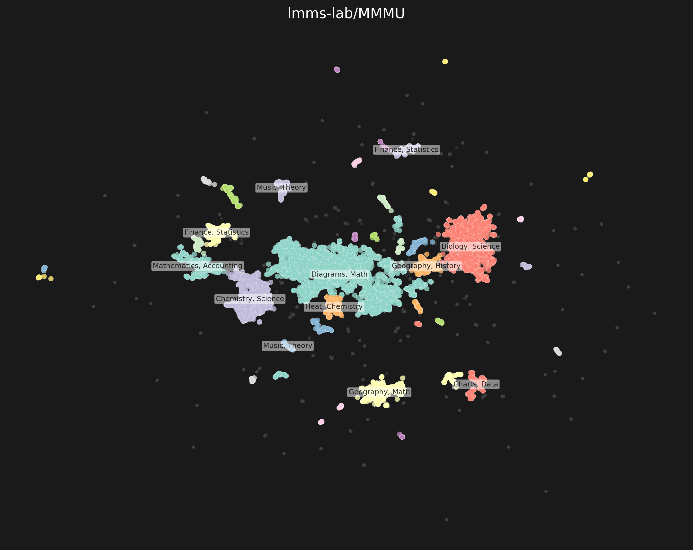

# Image Deduplication Toolkit

A comprehensive toolkit for detecting duplicate images across large-scale vision datasets using similarity search.

## Overview

This toolkit provides efficient image deduplication capabilities specifically designed for computer vision research and dataset curation. Built around Facebook's [SSCD (Self-Supervised Copy Detection)](https://github.com/facebookresearch/sscd-copy-detection) model, it enables researchers to:

- **Detect duplicate images** across and within datasets at scale
- **Generate perceptual embeddings** for large-scale image datasets
- **Visualize dataset structure** through clustering and semantic labeling
- **Query similar images** with sub-second search times

### Key Features

- Fast embedding computation with GPU acceleration
- High-precision duplicate detection using cosine similarity
- Interactive visualizations with automatic semantic clustering
- Single image queries against computed databases
- Comprehensive statistics and performance metrics
- HuggingFace integration for seamless dataset processing

## Installation

### Prerequisites
- Python 3.8+
- CUDA-compatible GPU (recommended)

### Setup Environment

```bash
# Create virtual environment with uv (recommended)
uv init --bare --python 3.10
uv sync --python 3.10
source .venv/bin/activate
uv pip install -r ./requirements.txt
```

### Download SSCD Model

```bash
# Create models directory
mkdir -p models/

# Download SSCD model from Facebook Research
# Option 1: Direct download (if available)
wget -O models/sscd_disc_mixup.torchscript.pt https://dl.fbaipublicfiles.com/sscd-copy-detection/sscd_disc_mixup.torchscript.pt

# Option 2: Manual download
# Visit: https://github.com/facebookresearch/sscd-copy-detection
# Download the model and place it in models/sscd_disc_mixup.torchscript.pt
```

> **Note**: If the direct download doesn't work, please follow the instructions at [SSCD repository](https://github.com/facebookresearch/sscd-copy-detection) to obtain the model weights.

## Quick Start

### Compute Embeddings for Your Dataset

```bash
# Generate embeddings for a HuggingFace dataset
python compute_embeddings.py \
  --dataset your-org/your-dataset \
  --split test \
  --output_dir embeddings \
  --batch_size 32

# All LMMS-Lab datasets
python run_lmms_embeddings.py
```

### Find Duplicates Between Datasets

```bash
# Compare your dataset against computed embeddings
python dedup_dataset.py \
  --dataset your-org/new-dataset \
  --split test \
  --precomputed_dir embeddings
```

**Output:** JSON file with duplicate statistics, indices, and similarity scores.
```json
{
  "dataset_name": "your-org/dataset",
  "total_images": 10000,
  "duplicate_count": 8532,
  "threshold": 0.90,
  "timing": {
    "total_time": 65.49,
    "embedding_computation": 40.83,
    "duplicate_detection": 24.66
  },
  "duplicate_details": [
    {
      "new_idx": 0,
      "new_image_id": 12345,
      "source_file": "reference_dataset_embeddings.npy",
      "source_idx": 67890,
      "similarity": 0.9876
    }
  ]
}
```

### Single Image Search

Find the most similar images to your query:

```bash
python utils/find_similar_images.py \
  --images image1.jpg image2.jpg \
  --embeddings embeddings/dataset_embeddings.npy \
  --image_ids embeddings/dataset_image_ids.npy \
  --dataset your-org/dataset \
  --top_k 5
```

**Output:** Console results + visualization grid showing query and similar images.

### Dataset Clustering

Visualize dataset structure with semantic clustering:

```bash
# Basic clustering
python cluster_embeddings.py \
  --embeddings embeddings/dataset_embeddings.npy \
  --eps 0.25 \
  --min-samples 20

# With auto-generated semantic labels
python cluster_embeddings.py \
  --embeddings embeddings/lmms-lab-MMMU_test_embeddings.npy \
  --eps 0.25 \
  --min-samples 20 \
  --generate-labels \
  --dataset lmms-lab/MMMU \
  --split test

```

### Clustering Visualizations



*Example: MMMU dataset clustering with semantic labels (Generated automatically)*

## Utility Scripts

### Count Embeddings
```bash
python utils/count_embeddings.py
# Shows statistics for all computed embeddings
```